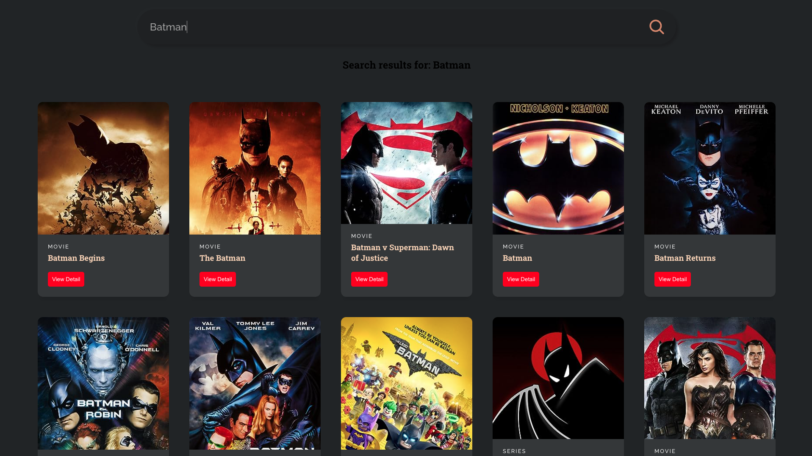

# Projet d'Application de Films en React

Ce projet est une application de films développée en utilisant React et en exploitant l'API [OMDB](https://www.omdbapi.com) pour obtenir des informations sur les films. L'application permet aux utilisateurs de rechercher des films, d'afficher des détails sur chaque film et d'explorer une variété de contenus cinématographiques.

## Fonctionnalités Principales

- **Recherche de Films :** Les utilisateurs peuvent effectuer des recherches de films en entrant des mots-clés, et les résultats correspondants sont affichés en temps réel.

- **Détails des Films :** Chaque film affiche des informations telles que le titre, l'année de sortie, les acteurs, le réalisateur, le résumé et la note.

- **Navigation Multi-Pages :** L'application utilise `react-router-dom` pour créer une navigation fluide entre différentes pages, notamment la page de recherche et la page de détails du film.

## Capture d'Écran

## Mise en Route

1. Clonez ce dépôt sur votre machine locale.
2. Installez les dépendances en utilisant la commande `yarn install`.
3. Obtenez une clé API OMDB en vous inscrivant sur [OMDB API](https://www.omdbapi.com) et remplacez-la dans le code.
4. Lancez l'application avec `yarn start`.

## Ressources Utilisées

- [API OMDB](https://www.omdbapi.com) pour l'accès aux informations sur les films.
- [React](https://reactjs.org/) pour la création de l'interface utilisateur interactive.
- [react-router-dom](https://reactrouter.com/web/guides/quick-start) pour la gestion de la navigation multi-pages.
- [Yarn](https://yarnpkg.com/) comme gestionnaire de paquets.

## Contributions

Les contributions sont les bienvenues ! Si vous souhaitez ajouter des fonctionnalités, améliorer l'interface utilisateur ou optimiser le code, n'hésitez pas à soumettre une demande d'extraction.

---

Ce projet a été créé par [CAZIMIRA Ambrosie](https://github.com/Ambrosioc) pour mettre en pratique les compétences en développement React, en utilisation d'API et en gestion de l'état global. L'application de films est destinée à illustrer comment créer une expérience interactive pour les amateurs de cinéma.
